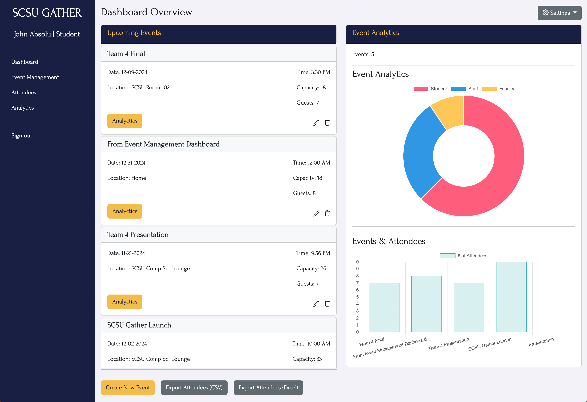

# SCSU GATHER

## How to Run This Project

### Setup

1. **Navigate to the Project Root**

   ```bash
   cd SCSU-Gather
   ```

2. **Install Packages**

   ```bash
   npm install
   ```

3. **Start the Server**

   Run the following command:

   ```bash
   npm run dev
   ```

   If the above doesn't work, try:

   ```bash
   npm index
   ```

### Create Database

1. **Navigate to the Database Directory**

   ```bash
   cd server/db
   ```

2. **Create the Database**

   ```bash
   node createDB.js
   ```

### Create Tables

1. **Navigate to the CRUD Directory**

  The path to the CRUD directory is termproject-team-4/server/CRUD

2. **Create the Tables**

   ```bash
   node create-tables.js
   ```

3. **Confirm Table Creation**

   Run the script to view the tables:

   ```bash
   node view-tables.js
   ```

   If all tables are not created, re-run the table creation script:

   ```bash
   node create-tables.js
   ```

### View the App

1. **Launch the App in Your Browser**

   Open your browser and go to:

   ```
   localhost
   ```

2. **Port Configuration**

   The default port number is `80`.  
   To use a different port, update the server configuration and restart the server.

---

## Screenshots

### Landing Page


### Sign in Page


### Sign up Page


### Main Dashboard


### Event Management Dashboard


### Account Settings | Personal Information


### Account Settings | Update PWD Deactivate Account
# SCSU-Gather
